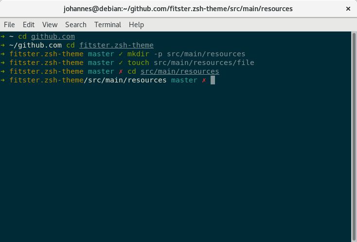

# fitster.zsh-theme
Modified version of 'gitster' theme from ZIM.
### Changes:
1. Use full `pwd` instead of `short_pwd`
2. Verbose `git-info` will show repo as dirty on untracked files.
3. Red dirty instead of yellow.
4. Yellow repo.
### Examples
#### Solarized

#### Gnome

