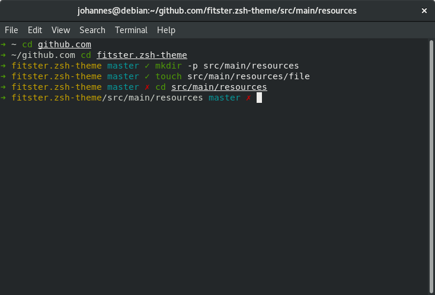

# bastard.zsh-theme
Modified version of [`gitster`](https://github.com/zimfw/zimfw/blob/master/modules/prompt/themes/gitster.zsh-theme) theme for [ZIM](https://github.com/zimfw/zimfw).
### Installation
1. Install Zsh (Debian)
```
$ sudo apt update && sudo apt install git zsh -y
```
2. [Install ZIM](https://github.com/zimfw/zimfw#installation)
```
$ curl -fsSL https://raw.githubusercontent.com/zimfw/install/master/install.zsh | zsh
$ zsh # restart
```
3. Install bastard.zsh-theme
```
$ echo 'zmodule https://github.com/jsundqvist/bastard.zsh-theme -n bastard' >> $HOME/.zimrc
$ zimfw install
$ zsh # restart again
```
### Dockerfile example
```
FROM bitnami/minideb

RUN apt-get update && apt-get install nano curl wget unzip zip tree git zsh -y && \
    echo 'set linenumbers' >> ~/.nanorc && \
    echo 'set tabsize 4' >> ~/.nanorc && \
    git config --global pull.rebase true
SHELL ["zsh", "-ic"]
RUN curl -fsSL https://raw.githubusercontent.com/zimfw/install/master/install.zsh | zsh && \
    echo 'zmodule https://github.com/jsundqvist/bastard.zsh-theme -n bastard' >> $HOME/.zimrc && \
    zsh -ic "zimfw install"
CMD ["zsh"]
```
### Changes from gitster
1. Use full `pwd` instead of `short_pwd`
2. Verbose `git-info` will show repo as dirty on untracked files.
3. Red dirty instead of yellow.
4. Symbols for `ahead`, `behind`, `diverged`, `bisect`, `merge`, `rebase` and `cherry-pick`.
5. Yellow repo.
6. Cyan branch if not `master`.
7. Timestamp in `RPROMPT`
### Pretty picture

